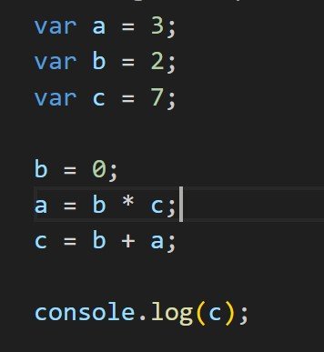

1. O que é uma variável na programação?
a. Uma variável é um tipo de dado em programação.
b. Uma variável é um operador em programação.
c. Uma variável é uma função em programação.
**d. Uma variável é um local de armazenamento temporário de dados.**

2. Qual é a diferença entre 'var', 'let' e 'const' na declaração de variáveis em JavaScript?
**a. 'var' é escopo global, 'let' é escopo de bloco e 'const' é uma constante.**
b. 'var' é escopo de bloco, 'let' é uma constante e 'const' é escopo global.
c. 'var' é uma constante, 'let' é escopo global e 'const' é escopo de bloco.
d. 'var', 'let' e 'const' são sinônimos e podem ser usados indistintamente.

3. Qual é o tipo de dado que representa um número em JavaScript?
a. Boolean
**b. Number**
c. Float
d. String
e. Integer
f. undefined

4. Qual é o tipo de dado que representa um texto em JavaScript?
a. Boolean
b. Number
c. Float
**d. String**
e. Integer
f. undefined

5. Olhe o código na imagem. Qual opção abaixo responde corretamente?

6. Qual a saída do código?

7. Quero criar uma variável para guardar a quantidade de maçãs no meu carrinho de compras, qual opção abaixo está correta?
a. var quantida de macas
b. var quantidadeDeMacas;
c. variavel quantidade de macas;
d. var quantidade_de_maçãs;

8. Qual opção abaixo responde corretamente?

9. Como podemos corrigir este código?

10. Qual a saída do código?

11. Qual resultado correto teremos...

12. O que teremos como retorno olhando a imagem?

